# Hey 👋, This is Taeyoon Kim

[](mailto:deepthought@postech.ac.kr)
[](https://www.linkedin.com/in/partrita/) 
[](https://www.github.com/partrita/)
[](https://www.twitter.com/partrita/) [](https://tomorrow-lab.github.io/)

<p align='left'>
I wear many hats: a biologist unraveling the mysteries of life, an artist finding expression through painting, a developer who crafts code with intention, and an author-in-the-making sharing stories and insights.

I find fulfillment in deep exploration, immersing myself in subjects that spark my curiosity. As an introvert, I cherish moments of solitude and reflection, where ideas have the space to take root and grow. I am often described as a 'slow thinker'—a label I embrace not as a sign of hesitation, but as a commitment to letting thoughts fully mature before they find their voice.

I thrive on diverse perspectives, constantly seeking new viewpoints that challenge my own and broaden my understanding. This relentless curiosity is what drives me to keep learning, creating, and exploring the world around me.
</p>

# My GitHub Stats

<p align=left>  </p>

<p align="center"></p>

<!-- README-STATS:START -->

```
🕰️ I get my jam on during the daytime!

🌞 Morning  	484    commits	███████░░░░░░░░░░░░░░░░░░░░░░░	13.20%
🌆 Daytime  	1991   commits	██████████████████████████████	54.28%
🌃 Evening  	978    commits	██████████████░░░░░░░░░░░░░░░░	26.66%
🌙 Night    	215    commits	███░░░░░░░░░░░░░░░░░░░░░░░░░░░	5.86%
```

```
📅 I'm most productive on Fridays!

Monday      	425    commits	█████████████████████░░░░░░░░░	11.59%
Tuesday     	587    commits	█████████████████████████████░	16.00%
Wednesday   	539    commits	███████████████████████████░░░	14.69%
Thursday    	459    commits	███████████████████████░░░░░░░	12.51%
Friday      	590    commits	██████████████████████████████	16.09%
Saturday    	570    commits	████████████████████████████░░	15.54%
Sunday      	498    commits	█████████████████████████░░░░░	13.58%
```

```
🧪 Python for the win!

Python      	38     repos	██████████████████████████████	32.76%
CSS         	15     repos	███████████░░░░░░░░░░░░░░░░░░░	12.93%
TeX         	11     repos	████████░░░░░░░░░░░░░░░░░░░░░░	9.48%
Dockerfile  	9      repos	███████░░░░░░░░░░░░░░░░░░░░░░░	7.76%
HTML        	9      repos	███████░░░░░░░░░░░░░░░░░░░░░░░	7.76%
```

<!-- README-STATS:END -->

# Random funny quotes

<a href='https://github.com/marketplace/actions/quote-readme'>
<!--STARTS_HERE_QUOTE_README-->
<i>❝The first 1GB hard disk drive was announced in 1980 which weighed about 550 pounds, and had a price tag of $40,000.❞</i>
<!--ENDS_HERE_QUOTE_README-->
</a>

# Random jokes

<a href="https://readme-jokes.vercel.app"></a>

# My streak

